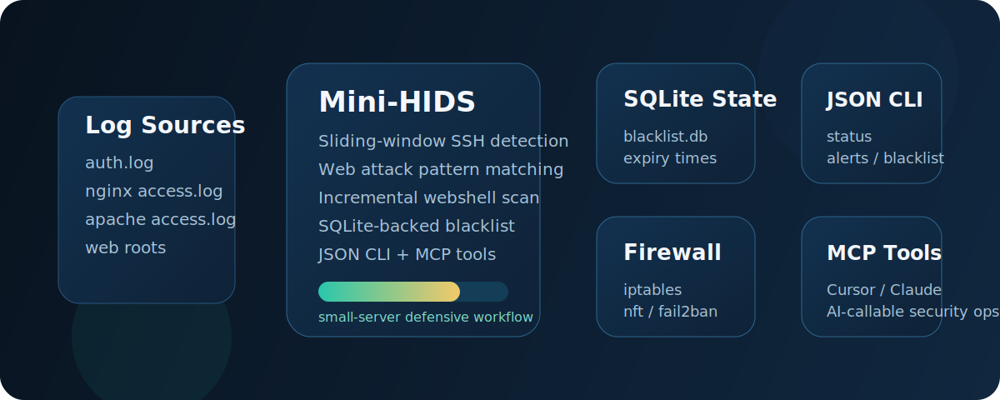

# Mini-HIDS

Stop brute-force IPs and suspicious web payloads on a small Linux server in minutes, without deploying a full SIEM or heavyweight EDR stack.



[中文文档](README_zh.md)

Mini-HIDS is a lightweight Linux host intrusion detection tool built with the Python standard library. It focuses on three things that are easy to operationalize on small servers:

- Detect repeated SSH login failures with a sliding time window
- Detect obvious web attack payloads from access logs
- Scan common script files for suspicious webshell patterns

Mini-HIDS is designed as an **agent-native** security tool. It exposes a local MCP server so AI agents can inspect status, read alerts, query the blacklist, and trigger ban or unban actions through a standard tool interface.

## Why This Exists

Most open-source security tools are optimized for human operators first. Mini-HIDS is intentionally small enough to understand quickly, script easily, and embed into agent workflows without a large control plane.

This repository is a good fit if you want:

- A single-host defensive tool for VPS or small Linux fleets
- An agent-native interface via MCP for AI-driven security operations
- Simple, inspectable detection logic instead of opaque pipelines

This repository is not a good fit if you need:

- Cross-host correlation or centralized SOC workflows
- Kernel telemetry, eBPF, or endpoint prevention
- High-fidelity detection engineering with low false positives

## Architecture

- `mini_hids.py`: long-running daemon that tails logs, tracks attack windows, bans IPs, and rescans web roots
- `hids_core.py`: control-plane API for MCP and agent integration
- `hids_common.py`: shared config loading, SQLite helpers, IP validation, and firewall backends
- `mcp_server.py`: stdio MCP adapter that exposes Mini-HIDS actions as agent-callable tools
- `config.json`: runtime configuration loaded by both the daemon and the MCP server
- `llms.txt`: LLM-oriented project map for AI search and coding assistants

## Quick Start

```bash
git clone https://github.com/netkr/mini-hids.git
cd mini-hids
```

Adjust `config.json`, then start the daemon:

```bash
sudo python3 mini_hids.py
```

## Use With AI Agents

Mini-HIDS ships with a local MCP server. Tools like Cursor, Claude Desktop, and other MCP-compatible clients can call the project directly.

Run the MCP server:

```bash
python3 mcp_server.py
```

Example client config:

```json
{
  "mcpServers": {
    "mini-hids": {
      "command": "python3",
      "args": ["/absolute/path/to/mini-hids/mcp_server.py"]
    }
  }
}
```

A ready-to-copy sample is also included at [`examples/claude_desktop_mcp.json`](examples/claude_desktop_mcp.json).

Available MCP tools:

- `mini_hids_status`
- `mini_hids_get_alerts`
- `mini_hids_get_blacklist`
- `mini_hids_ban_ip`
- `mini_hids_unban_ip`

This is the practical deployment model. Mini-HIDS needs local log access and firewall privileges, so local or server-side MCP integration is the correct approach.

## MCP Tool Output

All MCP tools return structured JSON. Example:

```json
{
  "success": true,
  "data": {
    "is_running": true,
    "pid": 12345,
    "firewall_backend": "iptables"
  }
}
```

## Requirements

- Python 3.6+
- Linux
- Root privileges for firewall operations and protected log access
- One supported firewall backend:
  - `iptables`
  - `nft`
  - `fail2ban-client`

## Configuration

Edit `config.json` instead of modifying the Python files.

```json
{
  "LOG_PATHS": {
    "auth": ["/var/log/auth.log", "/var/log/secure"],
    "web": ["/var/log/nginx/access.log", "/var/log/apache2/access.log"],
    "mysql": ["/var/log/mysql/mysql.log", "/var/log/mysql/error.log"]
  },
  "BAN_TIME": 3600,
  "TRUSTED_IPS": ["127.0.0.1", "192.168.1.1"],
  "WEB_ROOT": ["/var/www/html", "/var/www"],
  "BLACKLIST_DB": "blacklist.db",
  "ALERT_LOG": "hids_alert.log",
  "PID_FILE": "mini_hids.pid",
  "MAX_FAILURES": 5,
  "WINDOW_SECONDS": 300,
  "CHECK_INTERVAL": 1,
  "WEBSHELL_SCAN_INTERVAL": 3600
}
```

Notes:

- `BLACKLIST_DB`, `ALERT_LOG`, and `PID_FILE` can be absolute paths. If they are relative, they are created in the project directory.
- `CHECK_INTERVAL` controls how often the daemon checks for expired bans.
- `WEBSHELL_SCAN_INTERVAL` controls how often the daemon rescans web roots.
- `TRUSTED_IPS` are never banned by the daemon or the CLI.

## Security Notes

- Run the daemon as root if you need firewall enforcement or access to privileged logs.
- Review `TRUSTED_IPS` carefully to avoid locking yourself out.
- Web attack and webshell detection are heuristic. Treat alerts as signals, not final verdicts.
- MCP clients should be treated as privileged local integrations, since they can trigger ban and unban operations.

## Limitations

- Detection is regex-based and intentionally simple.
- The project does not yet ship with automated tests or service packaging.
- `nftables` support uses a dedicated `mini_hids` table and timeout-enabled sets, so existing firewall policies should still be reviewed before production use.


## v1.2 Release Notes

- Unified runtime configuration loading from config.json with default merging
- Added shared core module for config, firewall, IP validation, and blacklist persistence
- Added SQLite-backed blacklist persistence with automatic recovery and expired-entry cleanup
- Improved ban/unban idempotency and reduced risk of duplicate firewall rules
- Fixed firewall backend detection, including proper nftables support
- Improved daemon scheduling so ban expiry is checked on a short interval
- Added incremental webshell scanning based on file modification time
- Improved log tailing robustness with log rotation handling
- Normalized runtime file paths for blacklist.db, hids_alert.log, and mini_hids.pid

## v1.3 Release Notes

- Refactored to agent-native architecture, removing human CLI interface
- Created dedicated control-plane API module (`hids_core.py`) for MCP and agent integration
- Removed `hids_cli.py` and its argparse-based command-line interface
- Updated MCP server to import from control-plane API module
- Simplified project structure by eliminating dual-mode (CLI + MCP) design
- Updated documentation to reflect agent-native positioning and MCP-first workflow

## v1.4 Release Notes

- Extracted common ban/unban logic to `hids_common.py`, eliminating code duplication
- Added `validate_ban_request()`, `execute_ban()`, `execute_unban()` shared functions
- Added structured alert parsing with `parse_alert_line()` for agent-friendly output
- Added `mini_hids_scan_webshell` MCP tool for on-demand webshell scanning
- Extracted `WEBSHELL_PATTERNS` to shared module, removing duplicate definitions
- Added unit tests (`test_hids.py`) covering core functionality
- Added systemd service file (`mini-hids.service`) for production deployment
